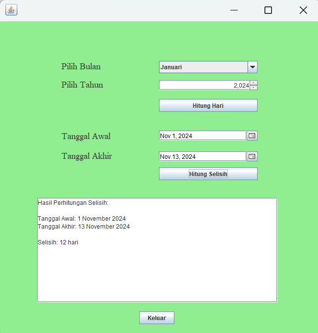

# AplikasiPerhitunganHari
 Ainun Nisa - 2210010099 - Tugas 4

# Aplikasi Perhitungan Hari
Aplikasi Perhitungan hari adalah Aplikasi untuk menghitung hari dalam bulan

# Keunggulan Aplikasi
Perhitungan Hari: Aplikasi ini menyediakan hitung hari, tahun kabisat dan ada hitung selisih hari

# Pembuat Aplikasi
Ainun Nisa - 2210010099 - Tugas 4

# Fitur
Aplikasi ini menawarkan fitur:
Perhitungan Hari Tahun kabisat Hitung selisih Hari

# Cara Menjalankan
Run File
Pilih Bulan Yang Kita Input
Tekan button Hitung hari, maka akan terlihat hasil hitung hari
Pilih tanggal awal dan tanggal akhir
Tekan button hitung selisih, maka akan terlihat hasil selisih hitung hari
Tekan button keluar, jika ingin keluar

# Demo
